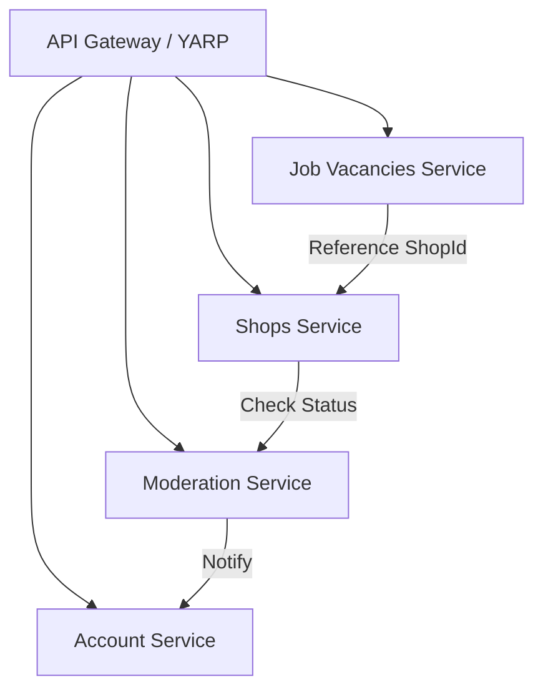

# Архитектурная карта доменов (DDD Context Map)

Этот документ описывает границы контекстов (Bounded Contexts) и их взаимодействия в проекте CoffeePeek.

## Ограниченные контексты

### 1. Account Context (CoffeePeek.AccountService)
- **Ответственность**: Управление пользователями, аутентификация (JWT), профили.
- **Ключевые сущности**: User, Role, PhotoMetadata.
- **Интеграции**: Identity Provider — Выдает токены для всех остальных сервисов.

    #### Login (`/api/token` `POST`)
    Все сессии отзываются в базе, и после чего создаётся новая сессия с новым access и refresh token.
    
    ### Refresh (`/api/token` `PUT`)
    Создаётся новый refresh token, после чего происходит rotate. Если токен не был отозван, не истёк и совпадает с пользователем, то всё произоёт успешно. Создастся новая сессия и пользователю дадут новую пару токенов.

    ### Register (`/api/users` `POST`)
    Проверяется по паттерну Bloom Filter существование пользователя по email. Если пользователя нету, то создаётся новый с валидацией. И добавляется дефолтная роль User. После успешной регистрации создаётся ивент `UserRegisteredInternalEvent` который обрабатывается и отправляеться сообщение на почту с помощью `Resend`

    ### Check User Exists (`/api/users` `GET`)
    Проверяет существование сначала с Bloom Filter, а потом проверяет в БД существование такого email.

    ### Logout (`/api/tokens` `DELETE`)
    
    ### OAuthLogin
    
    
### 2. Shops Context (CoffeePeek.ShopsService)
- **Ответственность**: Каталог кофейных шопов, геопозиции, меню.
- **Ключевые сущности**: CoffeeShop, Menu, Location.

### 3. Job Vacancies Context (CoffeePeek.JobVacancies)
- **Ответственность**: Объявления о работе, отклики.
- **Ключевые сущности**: Vacancy, Application.
- **Связи**: Ссылается на CoffeeShop ID из Shops Context.

### 4. Moderation Context (CoffeePeek.ModerationService)
- **Ответственность**: Проверка контента (фото, отзывы).
- **Ключевые сущности**: ModerationItem, Report.

## Схема взаимодействий (Mermaid)

## Стратегия интеграции
- **Asynchronous**: RabbitMQ для событий (например, `UserCreated`, `ShopModerated`).
- **Synchronous**: HTTP/gRPC только в исключительных случаях через API Gateway или внутренние адреса.
